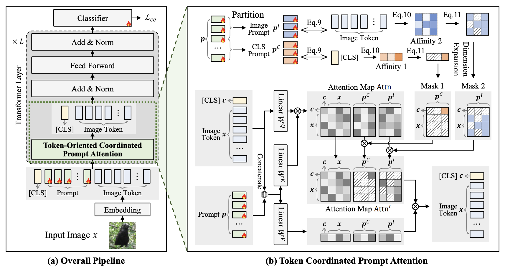
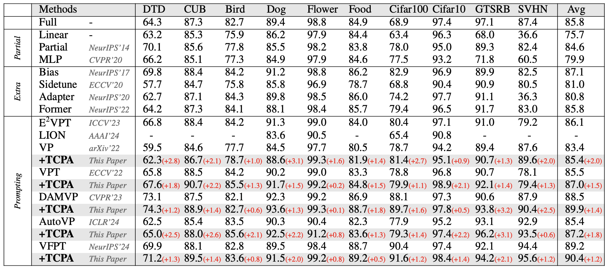

# [ICML2025] Token Coordinated Prompt Attention is Needed for Visual Prompting

<div align="center">

<div>
      Zichen Liu<sup>1</sup>&emsp; Xu Zou<sup>2</sup>&emsp; Gang Hua<sup>3</sup>&emsp;Jiahuan Zhou<sup>1 *</sup>
  </div>
<div>

  <sup>1</sup>Wangxuan Institute of Computer Technology, Peking University&emsp;
  <sup>2</sup>School of Artificial Intelligence and Automation, Huazhong University of Science and Technology&emsp;
  <sup>3</sup>Amazon.com, Inc&emsp;


</div>
</div>
<p align="center">
  <a href='https://arxiv.org/pdf/2505.02406'></a>
  <a href="https://github.com/zhoujiahuan1991/ICML2025-TCPA"></a>
</p>


The *official* repository for  [STOP: Integrated Spatial-Temporal Dynamic Prompting for Video Understanding](https://arxiv.org/pdf/2503.15973).





### Environment 
This code is based on pytorch2.4.0, pytorch-cuda11.8, and torchvision 0.19.0.

For a complete configuration environment, see environment.yaml


### Data and Model Preparation

We follow [DAM-VP](https://github.com/shikiw/DAM-VP) and use the HTA benchmark for experiments. Among them, CUB, Birds, Dogs, and Flowers can be downloaded in [VPT repo](https://github.com/KMnP/vpt), while the other datasets can be accessed through torchvision.


Then your data directory should be organized in the following format:

- **you_data_path**
  - *CUB*
  - *Birds*
  - *Dogs*
  - ···

The pre-trained model weights can be downloaded at [here](https://drive.google.com/file/d/1zvIqdml4KVArPuWspoHKU7a6e0uAunF8/view?usp=sharing).


### TCPA
Taking the dtd dataset as an example, you can run the following command:
```
python main.py --info="dtd-lr=0.01-wd=0.1" \
    --model=VFPT_TCPA --output_path="./Output_VFPT_TCPA" \
    --pretrained=imagenet22k --dataset=dtd\
    --batch_size=128 --lr=0.01 --weight_decay=0.1 --mixup=mixup \
    --len_prompts_cls=1 --len_prompts_image=1 \
    --topk_cls=10--topk_image=10 --pool_size_cls=18 --pool_size_image=18 \
    --base_dir='/your/data/path' \
    --RDVP --TDVP \
    --pool_loss_w=10--random_epoch=10
```
Or you can directly run the pre-written shell script:
```
chmod +x ./sh/VFPT_TCPA_dtd.sh
bash ./sh/VFPT_TCPA_dtd.sh
```


### Results

The comparison results on HTA benchmark. Partial, Extra, and Prompting represent partial tuning-based, extra module-based, and prompt learning-based methods respectively.




### Citation
If you find this code useful for your research, please cite our paper.
```
@article{liu2025token,
  title={Token Coordinated Prompt Attention is Needed for Visual Prompting},
  author={Liu, Zichen and Zou, Xu and Hua, Gang and Zhou, Jiahuan},
  journal={arXiv preprint arXiv:2505.02406},
  year={2025}
}
```


### Acknowledgement
Our code is partially based on the PyTorch implementation of [DAM-VP](https://github.com/shikiw/DAM-VP), [VPT](https://github.com/KMnP/vpt) and [VFPT](https://github.com/runtsang/VFPT). Thanks for their impressive works!

### Contact
For any questions, feel free to contact us ([lzc20180720@stu.pku.edu.cn](lzc20180720@stu.pku.edu.cn)).

Welcome to our Laboratory Homepage ([OV<sup>3</sup> Lab](https://zhoujiahuan1991.github.io/)) for more information about our papers, source codes, and datasets.


